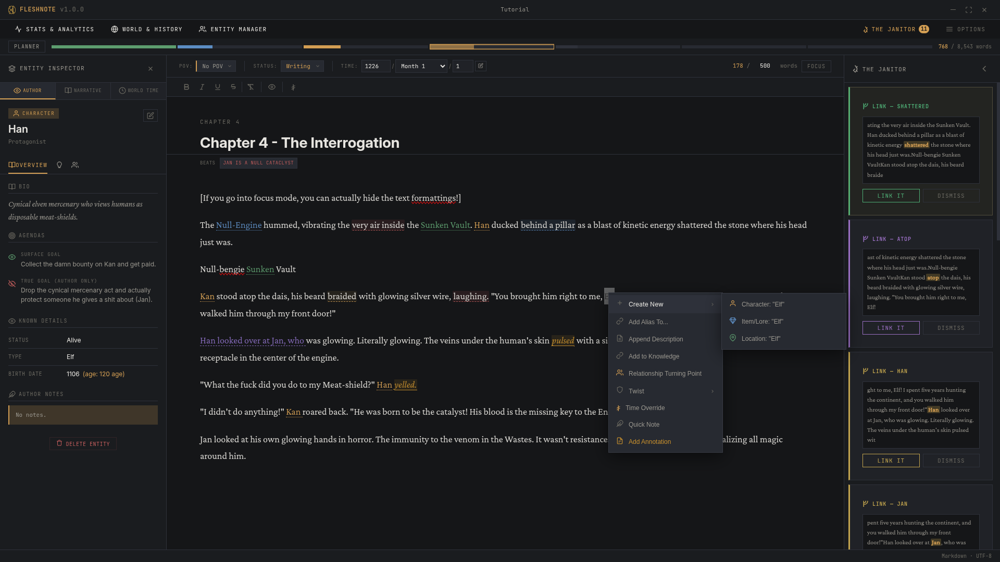
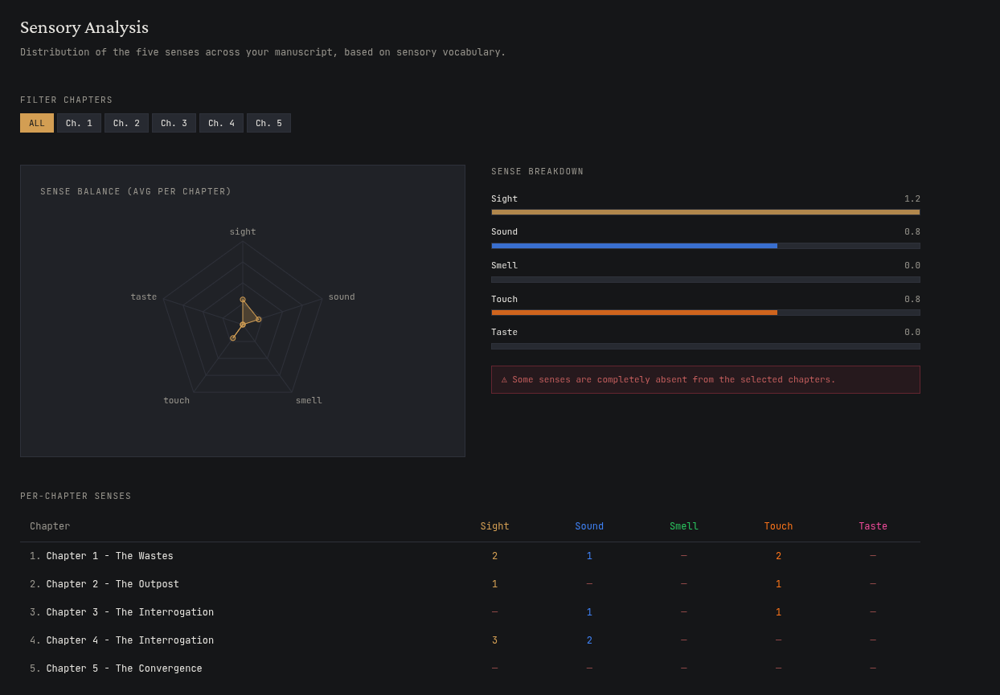
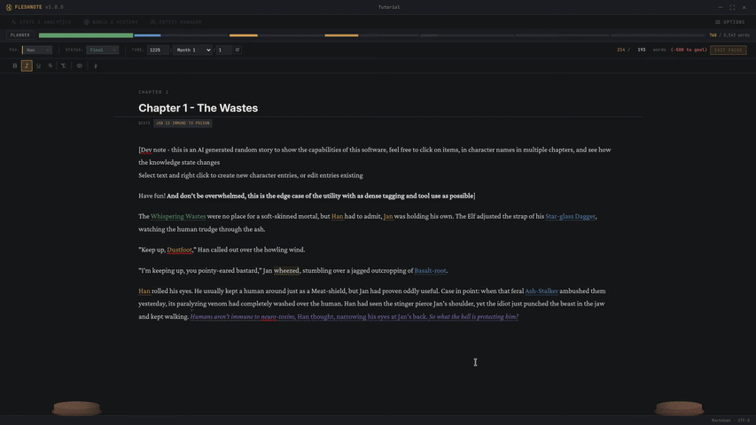
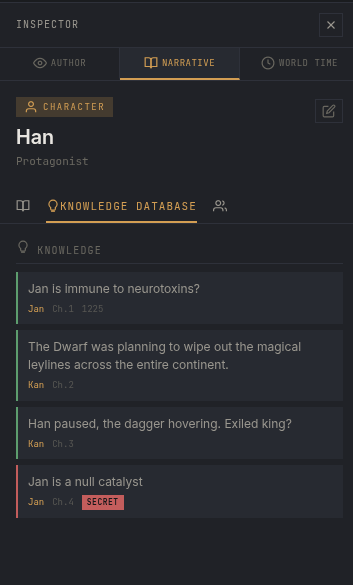
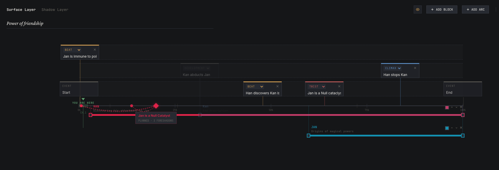
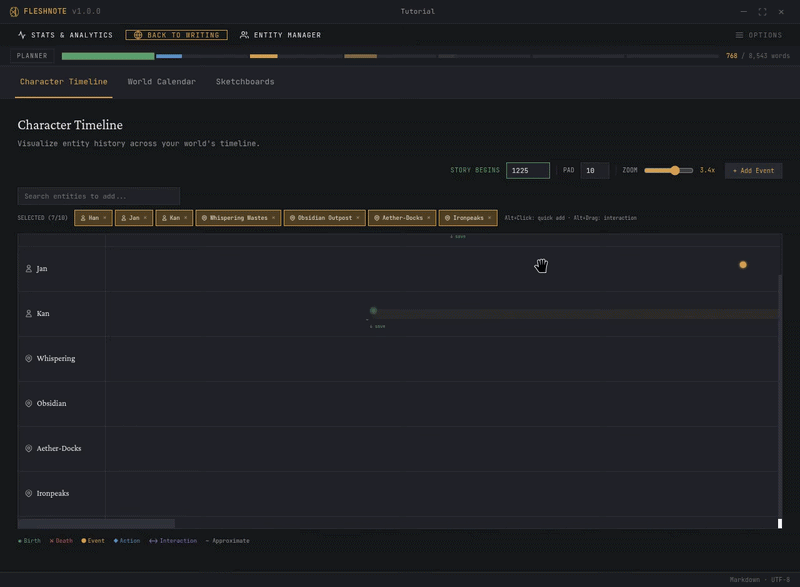
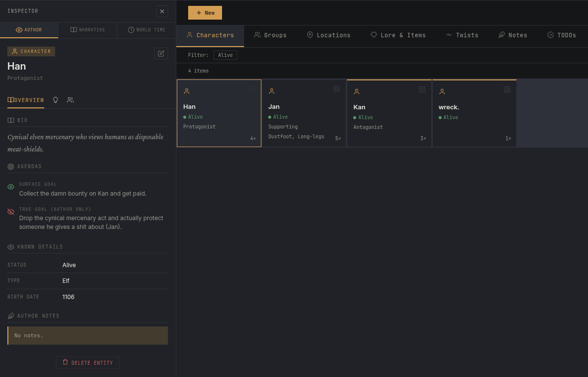
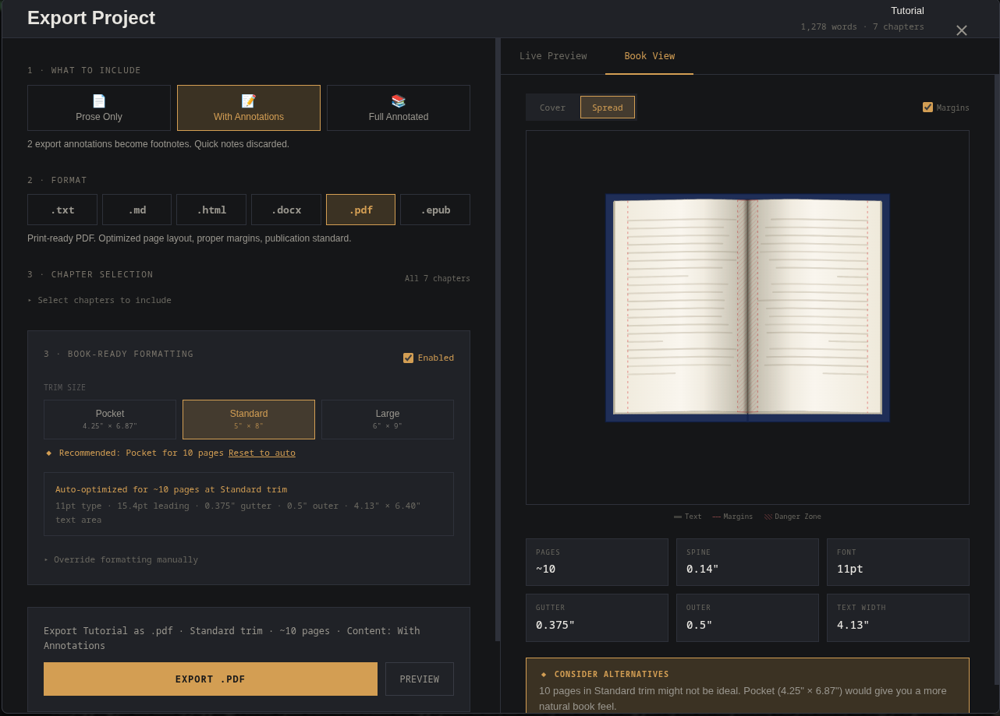

# FleshNote IDE (v1.1.0 Beta)

An advanced, no-bullshit writing tool for novelists and world builders who actually want to finish their draft this century. Built with Electron, React, TypeScript, and FastAPI.

[](https://opensource.org/licenses/MPL-2.0)



## Why FleshNote?

FleshNote was built by writers, for writers. I created this app mainly for myself to help me write my novel, but I decided to make it open source so that other writers can benefit from it as well.

### 🧹 The Janitor (Your Smart Editing Assistant)
Write now, edit later. The built-in Janitor actively reads your chapters in the background using local, offline linguistic analysis (spaCy & NLTK) to offer structural suggestions without ever interrupting your flow:
- **Sensory Analysis**: Avoid "White Room Syndrome." The Janitor tracks if your scene is missing descriptions of Smell, Taste, Touch, Sound, or Sight.
- **Show, Don't Tell**: Detects weak adverbs and passive voice.
- **Readability & Pacing**: Grades your chapter complexity and warns you if you start three sentences in a row with the exact same word.



### 🏃‍♂️ Hardcore Sprint Modes
Sometimes you just need a little push to get drafted. FleshNote gamifies the writing process with specialized, un-exitable Focus Modes:
- **Hemingway Mode**: The backspace and delete keys are completely disabled. No inner-editor allowed. You can only move forward!
- **Zen Mode**: Relax and watch a procedural tree grow on your screen as you hit your word count goals. Hitting your target makes the tree bloom.
- **Kamikaze Mode**: Stop typing for too long, and your text turns red before being permanently deleted. Survive the sprint!
- **Fog Mode**: Previous sentences fade into a thick fog, keeping your eyes locked on the *current* sentence so you don't scroll up.



### 🧠 Epistemic UI (Who Knows What?)
Track exactly what a character knows at any given point in your timeline. Use the **Entity Inspector** to lock away a character's "True Goal" while they lie to the reader, visually tracking narrative deception across chapters.



### 🗺️ Timeline & Plot Planner
A zoomable, multi-layer canvas for mapping out your story beats, arcs, and foreshadowing natively injected straight into the manuscript. 



### 📜 World History Timeline
Track what happened with your characters and items before the book even begins. Build a deep chronological history by dragging relationships and pinning major backstory events across an interactive, visual timeline.



### 📂 Unified Entity & Twist Tracking
Dumping lore into your project is easy. Managing it is easier. The codebase features a robust tabbed dashboard to manage Characters, Locations, Twists, and Quick Notes with bulk operations and inline tagging (`@mention` any character right in the editor).



### 📚 Professional Book Export
Export straight to industry-standard formatting. Generates print-ready PDFs, standard DOCX files, and EPUBs with a WYSIWYG  live preview.



### Other Features

- **Chapter Time Overrides**: Track flashbacks and timeskips at the paragraph level so your entities and relationship dynamics remain chronologically accurate.
- **Environment & Weather System**: Define weather states per location with **Hierarchical Inheritance** (sub-locations automatically pull weather from parents).
- **7 Total Sprint Modes**: Let it be Rewarding or Punishing, there is a mode for every writer.
- **Daily Writing Encouragement**: Context-aware prompts and streak tracking when you open your project.
- **Sketchboards & Mind-Mapping**: Visual node-graph canvas for mapping out magic systems, technology trees, and character webs.
- **Smart Entity Renaming Wizard**: Safely rename characters or locations across your entire manuscript with automated text-link rewriting.
- **Custom World Calendars**: Build your own calendar systems with custom months, seasons, and years for precise age and history tracking.
- **Image Gallery**: Each entity type has its own gallery and Icon. Add description, time, and crop icons.

---

# Getting Started

> ⚠️ **Windows Users:** I'm a solo indie dev and I don't plan on buying an expensive Windows Code Signing Certificate. When installing the app, Windows SmartScreen will show a scary blue pop-up warning you about an "unrecognized app". Simply click **More info** -> **Run anyway** to proceed with the installation!

### Prerequisites

- [Node.js](https://nodejs.org/) (Project uses npm)
- [Python 3.13](https://www.python.org/) (For backend services)

### Installation

1. Clone the repository and navigate into the `fleshnote-ide` subfolder:
   ```bash
   cd fleshnote-ide
   ```
2. Install the frontend dependencies:
   ```bash
   npm install
   ```
3. Setup the Python backend environment:
   ```bash
   cd backend
   python3 -m venv .venv
   source .venv/bin/activate  # On Windows: .venv\Scripts\activate
   pip install -r requirements.txt
   cd ..
   ```
   > **Note:** `requirements.txt` contains only runtime dependencies. If you plan to **build/package** the app with PyInstaller, use `requirements_build.txt` instead.

### Development
Run the application in development mode:
```bash
npm run dev
```

## 📦 Building for Production

You can build the production installer using the provided platform-specific scripts or npm commands. 

**IMPORTANT**: When building the app manually (via npm), you *must* also manually freeze the Python backend using PyInstaller first. The provided build scripts (`build.bat` and `build.sh`) handle this dual-compilation step for you automatically!

### Using Build Scripts (Recommended)

**Windows** (PowerShell/CMD):
```bash
./build.bat
```

**Linux/macOS** (Terminal):
```bash
chmod +x build.sh
./build.sh linux  # or ./build.sh mac
```

### Manual Build Commands

*(Remember to run PyInstaller on the backend first!)*

**Windows**
```bash
npm run build:win
```

**macOS**
```bash
npm run build:mac
```

**Linux**
```bash
npm run build:linux
```

**Linux (Flatpak)**

> **Note:** To build Flatpak correctly, you must ensure `flatpak` and `flatpak-builder` are installed on your system. 
> Since the bundler operates at the user-level, you also **must** have the Flathub remote added for your local user environment, or the build will fail:
> ```bash
> flatpak remote-add --user --if-not-exists flathub https://flathub.org/repo/flathub.flatpakrepo
> ```

```bash
npm run build:flatpak
```

## 🛠️ Recommended Setup

- **IDE**: [VSCode](https://code.visualstudio.com/)
- **Extensions**: 
    - [ESLint](https://marketplace.visualstudio.com/items?itemName=dbaeumer.vscode-eslint)
    - [Prettier](https://marketplace.visualstudio.com/items?itemName=esbenp.prettier-vscode)
    - [Tailwind CSS IntelliSense](https://marketplace.visualstudio.com/items?itemName=bradlc.vscode-tailwindcss)

## 📄 License

This project is licensed under the **Mozilla Public License 2.0**. See the [LICENSE](LICENSE) file for the full text.

---
Built with ❤️ by [Artfacility](https://www.artfacility.xyz)
